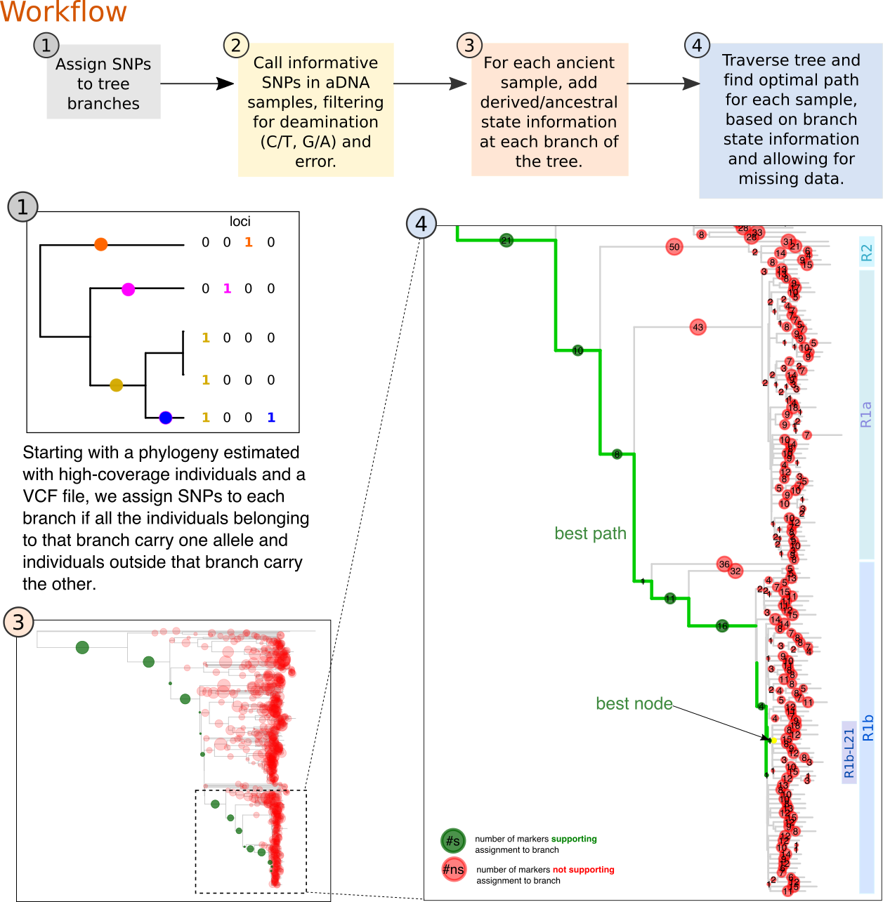

# pathPhynder v1.a
A workflow for ancient DNA placement into reference phylogenies.

Description: Ancient DNA data is characterized by deamination and low-coverage sequencing, which results in a high fraction of missing data and erroneous calls. These factors affect the estimation of phylogenetic trees with modern and ancient DNA, especially when dealing with many ancient samples sequenced to lower coverage. Furthermore, most ancient DNA analyses of the Y chromosome, for example, rely on previously known markers, but additional variation will continuously emerge as more data is generated. This workflow offers a solution for integrating ancient and present-day haploid data, first by identifiying informative markers in a high coverage dataset, second, by calling and filtering these SNPs in ancient samples and lastly, by traversing the tree and evaluate the number of derived and ancestral markers in the ancients to find the most likely branch where it belongs.


_________________________________________________

### pathPhynder Installation

Prerequisites:

 - R language (https://www.r-project.org/)
 - python 3 (https://www.python.org/)
 - samtools (http://www.htslib.org/)


Install the following R packages:
```
install.packages('optparse')
install.packages('phytools')
install.packages('scales')
```

1) Download pathPhynder to your computer
```
git clone https://github.com/ruidlpm/pathPhynder.git
```

2) Add the following line to your ~/.bash_profile (create one if necessary). Replace <path_to_pathPhynder_folder> with the location of the pathPhynder folder in your system.
```
alias pathPhynder="Rscript <path_to_pathPhynder_folder/pathPhynder.R>"
```
For example, if you have downloaded the folder to your ~/software/ directory, then you would add the following lines to ~/.bash_profile.
```
alias pathPhynder="Rscript ~/software/pathPhynder/pathPhynder.R"
```
and then:
```
source ~/.bash_profile
```

3) Test the installation.

```
pathPhynder -h
```


### phynder Installation

For more details, you can visit the original repository:
https://github.com/richarddurbin/phynder

```
git clone https://github.com/samtools/htslib.git
cd htslib
make lib-static htslib_static.mk
cd ..
git clone https://github.com/richarddurbin/phynder.git
cd phynder
make
make install
```

(Note: If on macOS, you may need conda install clangxx_osx-64)
_________________________________________________

For a quick start with the Y-chromosome reference dataset see the tutorial:

https://github.com/ruidlpm/pathPhynder/tree/master/tutorial


For detailed instructions of how to use your own data, see the workflow below.





### Workflow

0) Generate a phylogeny from a vcf file (Use RAxML or MEGA, for example, running for several iterations). The quality of the tree has a major impact on SNP assignment to branches and therefore on all downstream analyses.

1) Assign informative SNPs to tree branches.

```bash
#will output the branches.snp file with information about which SNPs map to each branch of the tree.
phynder -B -o branches.snp tree.nwk tree.vcf.gz

```

2) Run pathPhynder to call those SNPs in a given dataset of ancient samples and find the best path and branch where these can be mapped in the tree.

```bash
#Prepare data - this will output a bed file for calling variants and tables for pylogenetic placement
pathPhynder -s prepare -i tree.nwk -p <prefix_output> -f branches.snp

#Run pathphynder
pathPhynder -s all -i tree.nwk -p tree_data/<prefix_output> -b <sample.bam>

# OR if analysing multiple bam files
pathPhynder -s all -i tree.nwk -p tree_data/<prefix_output> -l <bam_list>
```

If you want to run each step individually:
```bash
#For each ancient sample, run pileup at informative branch-defining sites, filtering for
# deamination and mismatches. 
pathPhynder -s <1 or pileup_and_filter> -i <tree>.nwk -p tree_data/<prefix_output> -l <sample.list>

#For each ancient sample, add derived and ancestral status information at each branch of the tree.
#Traverse the tree, evaluating the count of ancestral and derived markers at each branch,
# and identify the best path
pathPhynder -s <2 or chooseBestPath> -i <tree>.nwk -p tree_data/<prefix_output> -l <bam_list>

#Add the ancient samples into the original phylogeny
pathPhynder -s <3 or addAncToTree> -i <tree>.nwk -p tree_data/<prefix_output> -l <bam_list>
```


There are also a few additional parameters that can be adjusted according to the user's needs.

pathPhynder -h.
```
Options:
	-s STEP, --step=STEP
		Specifies which step to run. Options:
    			- prepare - prepares files for running pathPhynder.
    			- all - runs all steps to map ancient SNPs to branches (1,2,3).
    			- 1 or pileup_and_filter - runs pileup in ancient bam files and filters bases.
    			- 2 or chooseBestPath - finds the best branch/node of the tree for each sample.
    			- 3 or addAncToTree - adds ancients samples to tree.
    			[default all]

	-i INPUT_TREE, --input_tree=INPUT_TREE
		Input tree in Newick format. [required]

	-f BRANCHES_FILE, --branches_file=BRANCHES_FILE
		branches.snp file - SNP placement file created with phynder.

	-p PREFIX, --prefix=PREFIX
		Prefix for the data files associated with the tree.
        	These were previously generated in the branch assignment step. [required]

	-b BAM_FILE, --bam_file=BAM_FILE
		Input bam file. [required]

	-l LIST_OF_BAM_FILES, --list_of_bam_files=LIST_OF_BAM_FILES
		List of paths to bam files. [required]

	-r REFERENCE, --reference=REFERENCE
		Reference genome (fasta format). [default "/Users/rui/software/pathPhynder/R/../data/reference_sequences/hs37d5_Y.fa.gz"]

	-m FILTERING_MODE, --filtering_mode=FILTERING_MODE
		Mode for filtering pileups.  Options: default, no-filter or transversions. [default "default"]

	-t MAXIMUMTOLERANCE, --maximumTolerance=MAXIMUMTOLERANCE
		Maximum number of ALT alleles tolerated while traversing the tree.
                If exceeded, the algorithm stops and switches to the next path. [default 3]

	-q BASEQUALITY, --baseQuality=BASEQUALITY
		Minimum base quality for samtools mpileup. [default 20]

	-c PILEUP_READ_MISMATCH_THRESHOLD, --pileup_read_mismatch_threshold=PILEUP_READ_MISMATCH_THRESHOLD
		Mismatch threshold for accepting a variant (for cases where reads for both alleles are present in pileup).
        	For a variant to pass filtering, reads containing the most frequent allele have to occur at least
        	at x proportion of the total reads. 1 is the most stringent, 0.5 is the most relaxed. [default 0.7]

	-o OUTPUT_PREFIX, --output_prefix=OUTPUT_PREFIX
		Sample name. This only works if a single bam file is used as an input. [default bamFileName]

	-G HAPLOGROUPS, --haplogroups=HAPLOGROUPS
		List of known haplogroup defining SNPs

	-h, --help
		Show this help message and exit

```


Tutorial:

https://github.com/ruidlpm/pathPhynder/tree/master/tutorial


Citation:

Placing ancient DNA sequences into reference phylogenies
