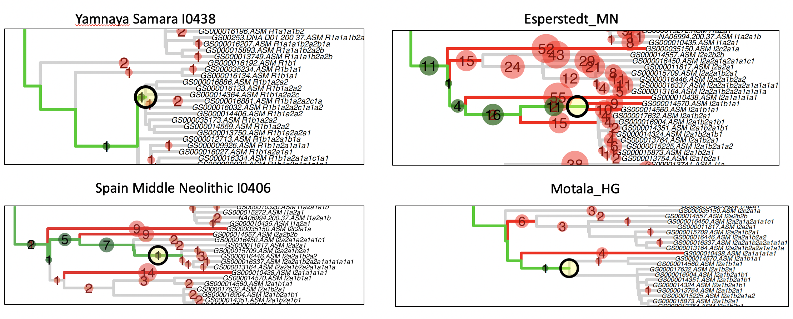

# Tutorial

In this tutorial, we are going to identify informative SNPs in the Karmin et al., 2015 Y-chromosome dataset and then add ancient samples into the tree.

You can find the original paper here
https://genome.cshlp.org/content/25/4/459.full


step 1 - Assign SNPs to branches of the tree

```bash
#download the Karmin VCF file
wget http://evolbio.ut.ee/chrY/PLINKandVCF/Karmin_et_al_2015_chrY_452samples_CGonly_filtered1_noAustralians.vcf

#the tree estimated for this dataset is in the tutorial folder
karmin.nwk

#assign SNPs to branches of the tree
time pathPhynder -s assign -i karmin.nwk -v Karmin_et_al_2015_chrY_452samples_CGonly_filtered1_noAustralians.vcf -p karmin_data

	Assigning SNPs to branches.

	 901/901 nodes;    found 31829 branch defining alleles (REFs=956 / ALTs=30873)


	table with markers assigned to each branch written to tree_data/karmin_data.edge_df.txt)

	31829 informative positions (auxiliary information written to tree_data/karmin_data.sites.txt)

	31829 informative positions for variant calling (written to tree_data/karmin_data.sites.bed)

	3728 positions were not added (report written to tree_data/karmin_data.report_not_added_SNPs.txt)


real	5m57.591s
user	5m12.266s
sys	0m39.199s
```

In the branch assignment run, 3728 SNPs were not added, mostly because of missing data.
We can recover a fraction of these by imputing missing genotypes.

```bash
#Optional (and slow)
time Rscript R/Ympute.R karmin.nwk Karmin_et_al_2015_chrY_452samples_CGonly_filtered1_noAustralians.vcf karmin_imputed.vcf

#real	31m11.612s
#user	27m18.203s
#sys	3m27.671s

pathPhynder -s assign -i karmin.nwk -v karmin_imputed.vcf -p karmin_data_imputed

	table with markers assigned to each branch written to tree_data/karmin_data_imputed.edge_df.txt)

	34690 informative positions (auxiliary information written to tree_data/karmin_data_imputed.sites.txt)

	34690 informative positions for variant calling (written to tree_data/karmin_data_imputed.sites.bed)

	867 positions were not added (report written to tree_data/karmin_data_imputed.report_not_added_SNPs.txt)

Now, only 867 mutations were not added, so imputation allowed recovering around 3000 SNPs. This may be because of missing data which cannot be imputed, or that the SNP patterns 
observed are incompatible with the tree, or that the SNP is monomorphic.

```


Description of the output files of the branch assignemnt step.

```bash
karmin_data.edges_df.txt - contains information about SNPs found at each branch.


karmin_data.sites.bed - contains the coordinates of branch defining varaints which will be called in the ancient samples
Y	2650700	2650701
Y	2650852	2650853
Y	2651026	2651027
Y	2651324	2651325
...

karmin_data.sites.txt - contains information about each informative variant, including if they define any known haplogroup and whether the derived allele is ALT (+) of REF (-). It also states to which branch they have been assigned to (706, 707, 901, etc).
Y	U1	G2a2b2a1a1a	15058878	G->A	G	A	706	-
Y	Z6390	G2a2b2a1a1a2	2830607	C->A	C	A	707	+
Y	NA	NA	28715314	C->T	C	T	901	+
...

karmin_data.report_not_added_SNPs.txt - coordinate of SNP and reason why it was not added
2650414	monomorphic snp
2657176	incompatible with tree
2661371	missing data
...
```

step 2 - Adding ancient samples to the tree - example with 27 samples from Haak et al. (2015)
You can get them from this link
https://drive.google.com/open?id=1utVO5pua6dk8eUtW3CiEup5ouomwN6QT

```
#Here, we are using the same tree but with haplogroup labels for visualization purposes
pathPhynder -s all -i karmin_hgs.txt -p tree_data/karmin_data -l sample.list

#note - if you imputed your data, use tree_data/karmin_data_imputed rather than tree_data/karmin_data

real	2m44.761s
user	2m33.428s
sys	0m6.820s
```

Some examples of the output:




Description of the  output files of step 2.

```
<sample>.pileup.txt - pileup for a given sample at branch defining SNPs
Y       2650701 G       2       ..      JJ
Y       2657214 G       1       ,       J
Y       2657247 G       1       ,       J

<sample>.intree.txt - status at each marker after filtering
23973594 G T 0 2 1
23980238 C A 1 0 0
23987274 C T 1 0 0

<sample>.best_path.pdf - contains tree and best path for a given sample. Red and green circles indicate ancestral and derived alleles, respectivelly.

<sample>.best_path_report.txt - counts of markers supporting and in conflict with membership to a branch for the best path.

<sample>.all_paths_report.txt - counts of markers supporting and in conflict with membership to a branch for all paths.

<sample>.best_node_info.txt - node where the ancient sample belongs

<sample>.hg_in_tree_status.txt - counts of markers at haplogroup defining branches (markers in the tree data only)

<sample>.hg_in_tree_status_derived_only.txt - counts of derived markers at haplogroup defining branches (markers in the tree data only)

final_tree.nwk - newick tree with ancient samples added into it.

final_tree.pdf - figure of the tree with ancient samples added into it.

```


Additional comments:

This is an useful tool for exploration of Y-chromosome data and ancient DNA sample affinity to present-day lineages.
I recommend exploring the different parameters, especially the stringency of the filtering ('conservative' or 'relaxed'),
the number of ancestral markers tolerated at a branch before switching to a different path, and the pileup mismatch threshold.
These can give slightly different results, and different parameters will definitely work better for some samples than for others,
depending on the nature of the data (shotgun sequencing vs capture, UDG/USER treatment vs. untreated, coverage, etc...) 
